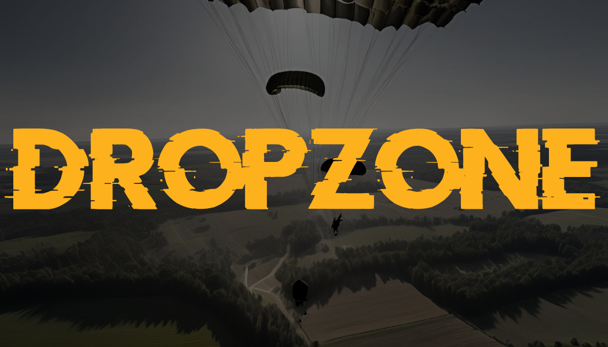

**DROPZONE: The Community Mod Manager for DCS World**

DROPZONE simplifies managing mods for DCS World, pulling its curated mod list directly from the [DCS Mod Manager Registry](https://github.com/flying-dice/dcs-mod-manager-registry).

Mod installation is managed by DROPZONE, it will download, unpack, and symlink mods into your DCS World directories. This allows you to easily enable and disable mods without having to manually manage files.

To suggest a mod or contribute, create an issue or submit a pull request on the registry's GitHub repository.

### Key Features

- [x] **Initial Release**: The first version of DROPZONE is now available for download with support for mod subscribing, downloading, unpacking, enabling, and disabling.
- [x] **Mod Library**: Browse and search for mods in the Library, and subscribe to mods to add them to your collection improving discoverability of mods.
- [ ] **Mod Popularity**: Implement a system to track and display the popularity of mods based on the number of subscribers and downloads.
- [ ] **Mod Ratings**: Allow users to rate mods and provide feedback to mod creators.
- [ ] **Mod Comments**: Enable users to leave comments on mods to provide feedback, suggestions and help other users.
- [ ] **Mod Update Improvements**: Enhance the mod update process to make it more intuitive to transition to the latest version.
- [ ] **MissionScripting.lua Support**: Integrate support for managing MissionScripting.lua file and historical versions to prevent DCS updates from breaking mods that rely on this file being modified.
- [ ] **MissionScripting Requirements**: Implement a system to manage the requirements for MissionScripting.lua files, ensuring that the user has the necessary modifications in place to allow mods to function correctly.

## Installation

Download the latest version of DROPZONE from the [releases page](https://github.com/flying-dice/dcs-dropzone-mod-manager/releases) and run the setup.exe file.

## Usage

1. **Initial Launch**: When you first launch DROPZONE, you'll be prompted to accept the disclaimer and privacy policy. Once you've accepted these terms, you'll be taken to the My Content page, where you can view your subscribed mods. As a new user, this page will be empty so you'll need to subscribe to mods from the Library.
2. **Library**: Accessed via the Library tab in the Left Sidebar, this page allows you to browse and search for mods. You can subscribe to mods by clicking on the Subscribe button on each mod card.
3. **My Content**: Once you've subscribed to mods, you can view them on the My Content page. Here, you can enable, disable, update, or unsubscribe from mods.
4. **Settings**: Accessible via the Settings tab in the Left Sidebar, this page allows you to configure settings such as the mod installation directory and view the current version of DROPZONE.

### Key Concepts

#### Subscribing to Mods

To subscribe to a mod means to download and unpack the mod's assets. With a mod subscribed but not enabled, the assets are downloaded and unpacked but not symlinked into the game's directory. This allows you to manage which mods are active in your game without having to redownload them.

#### Enabling and Disabling Mods

Enabling a mod means to symlink the mod's assets into the game's directory. This makes the mod active in your game. Disabling a mod means to remove the symlinks, effectively removing the mod from your game without having to redownload it.

#### Updating Mods

Currently updating a mod is the same as unsubscribing and then resubscribing to the mod. This will download the latest version of the mod and unpack it ready for enabling.

In the future, we want this to be a better experience where you can update a mod alongside the existing version and then switch when you're ready.

## Updating

DROPZONE will automatically check for updates when you launch the application. If an update is available, you'll be prompted to download and install it.

If you chose to proceed to use the application without installing immediately the update will be downloaded and installed the next time you launch the application.

It is recommended to keep DROPZONE up-to-date to ensure you have the latest features and bug fixes.

## Development

See the [CONTRIBUTNG.md](CONTRIBUTNG.md) for more information on how to contribute.
